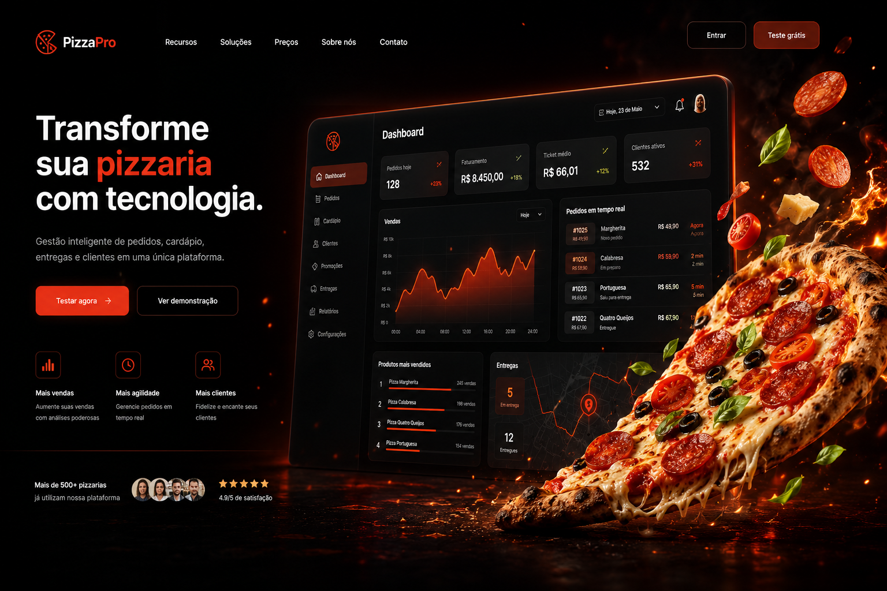

# Projeto Pizzaria
<p align="center">  </p> </p>
📖 Sobre o projeto
Sistema SaaS para pizzaria em desenvolvimento, com foco em criar um MVP vendável em 4 a 5 semanas. O projeto está sendo construído em equipe, com backend em FastAPI e frontend em React + Vite.

## Visão geral da estratégia

O objetivo do projeto é evoluir até um produto utilizável comercialmente em sprints curtas:

- **Sprint 1–2:** base funcional do sistema, já permitindo testar pedidos
- **Sprint 3:** sistema utilizável de verdade
- **Sprint 4:** painel administrativo + operação real
- **Sprint 5:** diferenciais de produto

## Sprint 1 — Fundação do Sistema

### Objetivo

Colocar o projeto rodando com autenticação e base de dados.

### Backend

Responsável pela construção da API e da base do sistema com:

- Setup do projeto em **FastAPI**
- Estrutura modular com:
  - `auth`
  - `users`
  - `products`
- Autenticação com **JWT**:
  - login
  - register
- Modelagem inicial com **PostgreSQL**:
  - `User`
  - `Product`
  - `Category`

### Frontend

Atualmente estou atuando como **desenvolvedor front-end** do projeto.

O frontend está sendo desenvolvido com **React + Vite**, com foco em construir uma base sólida de **UX/UI** e organização da aplicação.

Neste momento, estou trabalhando em:

- Estrutura inicial do projeto frontend
- Configuração de rotas
- Criação do layout base da aplicação
- Construção da base visual com **Stitches**
- Telas iniciais de:
  - Login
  - Cadastro
- Integração futura com a API usando **axios** ou **fetch**

## Tecnologias utilizadas

### Frontend

- React
- Vite
- JavaScript
- CSS
- Stitches

### Backend

- FastAPI
- PostgreSQL
- JWT

## Meu papel no projeto

Sou o responsável pelo **front-end** da aplicação, estruturando a interface, experiência do usuário e base visual do sistema.

Meu foco atual está em:

- organização das rotas
- definição do layout
- padronização de componentes
- base de UX/UI
- preparação do frontend para integração com a API

## Status do projeto

O projeto está em fase inicial de desenvolvimento, com a fundação do sistema sendo organizada na primeira sprint.

## Próximos passos

- Finalizar rotas principais
- Consolidar o layout base
- Evoluir a identidade visual da aplicação
- Implementar telas funcionais de autenticação
- Iniciar integração com o backend

## Como executar o projeto

```bash
npm install
npm run dev
```

## Observação

Este README será atualizado conforme novas funcionalidades e sprints forem sendo concluídas.
